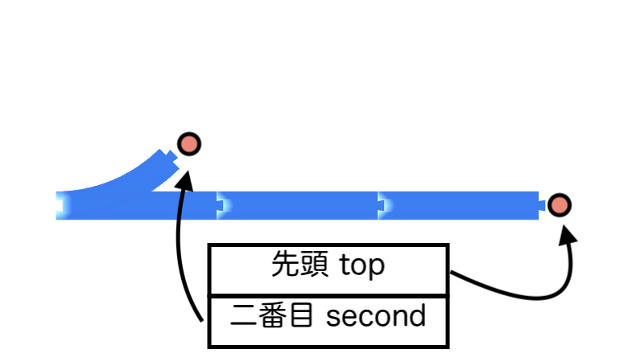
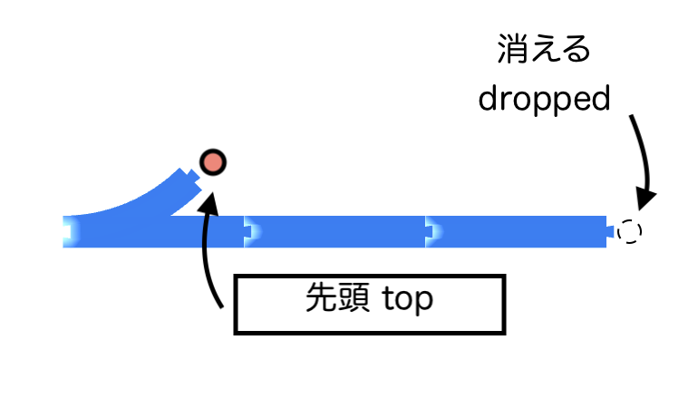

# Railforth
Railforth はプラレールのレイアウトを記述するための言語です。
現在はプロトタイプとして公開しており、仕様が大幅に変わる可能性があります。

## デモ
[デモページ](https://akamah.github.io/proto-railforth/) で動作を確認することができます。
こちらの初期データは [OSC 2023 Nagoya](https://event.ospn.jp/osc2023-nagoya/) で展示するレイアウトです。

## はじめに
Railforth はFORTHおよびLOGOに影響を受けた言語です。命令はスペース区切りで並べて記述します。
以下のようなプログラムで、このようなレイアウトを記述できます。

```
s l r
```


1つ目の `s` という命令で、直線レールを敷きます。
2つ目の `l` という命令では、その直線レールに繋いで左方向に45度曲がるレールを敷きます。
3つ目の `r` という命令では、さらに繋げて右方向に曲がるレールを敷きます。

ちなみに、 `S` や `L` のように、大文字で書くことはできません。
現代においてはキーボードで打つのが大変だし、表記ゆれの原因になるからです。

それと、必ずそれぞれのコマンドは空白を開けて記述してください。
空白は、スペースやタブ、改行文字の組み合わせです。
そのため、 `sl` のように続けて書くと、 `sl` なんてない、というエラーが発生して描画が中断されます。（残念ながら、SL列車が走り抜けることはないです）

## 分岐レールについて。
`tr` および `tl` を使うと分岐レールを敷くことができます。
それぞれ、 直線方向と右折の分岐と、直線方向と左折の分岐です。
分岐レールは今までのレールと違い、二手に分かれるため扱いに気をつける必要があります。

分岐を持つようなレールについては、反時計回りに見て次の端点から繋がっていきます。
例えば、

```
tl s s
```

のように記述すると、まずは向かって直線方向に繋がります。


逆に、右への分岐を使うと、今度は右折方向へと伸びていきます。
これが、反時計回りに見て次の端点につながる、ということです。

```
tr s s
```


では、もう片方の端点から伸ばすのはどうすればよいでしょうか？
再度、 `tl s s` の例に戻ります。


このとき、Railforthの内部では、2つの点を管理しています。ひとつが、直進方向に進むという点、
そしてもう一つが、分岐の左折方向の点です。これらがスタックの要素として管理されています。

スタックの先頭には直進方向の点が、その次（今は一番下ですね）には左折方向の点があります。
そして、線を伸ばす際には、 **スタックの先頭にある点** にレールをつなぐように線路を伸ばします。



では左折方向に伸ばしたくなったらどうするかというと、スタックの先頭から直進方向の点を取り除く必要があります。
Railforth には各種のスタック操作命令がありますが、先頭から取り除くには `.` を使用します。
これも、空白で区切って一文字で入力してください。

すると、スタックはこのような状態になります。

`tl s s .`



その後は、左折方向に線路を延ばすことができます。

こういった事情から、RailforthはFORTHのスタック操作の利点と、
LOGOのタートルグラフィックスの概念を組み合わせた言語にする必要があったのです。

ちなみに、オリジナルのFORTH と同様、`swap` 命令を使うとスタックの上ふたつを入れ替えられたりします。
その他にも、スタック操作命令を追加する予定です。

## 命令一覧　（未完成）
ほかにも様々なレールがあります。ちょっと時間がいまないため、とりあえず[こういう命令があるよ](https://github.com/akamah/proto-railforth/blob/754fbe3b8e674ec0976925f699c7db4162aa810f/src/Forth/Interpreter.elm#L82-L125)、というのを共有します。


## How to Build
Railforthは [Elm 0.19](https://elm-lang.org) を用いて開発されています。

### ライブビルド
[elm-live](https://www.elm-live.com) を利用して手元で動かすには、以下のようなコマンドを使います。
```elm-live src/Main.elm --open --start-page=./index.html -- --output=./build/main.js```

### ビルド
以下のコマンドでビルドができます。
```elm make --output=build/main.js --optimize src/Main.elm```
